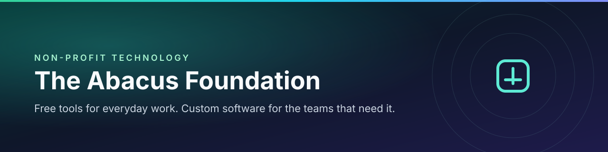

 

**A non-profit technology organization** building free, private tools for everyday life — and shipping custom software for organizations that need something purpose-built.

 

  <a href="https://theabacusfoundation.org"><b>Foundation</b></a>
  &nbsp;·&nbsp;
  <a href="https://accounting.theabacus.org"><b>Accounting</b></a>
  &nbsp;·&nbsp;
  <a href="https://pdf.theabacus.org"><b>PDF</b></a>
  &nbsp;·&nbsp;
  <a href="https://calculator.theabacus.org"><b>Calculators</b></a>
  &nbsp;·&nbsp;
  <a href="https://apps.apple.com/us/app/abacus-calculators-suite/id6756740335"><b>iOS app</b></a>
  &nbsp;·&nbsp;
  <a href="https://theabacusfoundation.org/projects"><b>Projects</b></a>

---

## What we stand for

Technology should be useful without a subscription wall, a tracking script, or a lock-in clause. We build software people can actually own — then we teach enough of the stack that it keeps running.

| Free to use | Private by default | Open where it matters | Built to last |
| :---: | :---: | :---: | :---: |
| No paywalls on the tools we publish | Work stays on your device whenever we can | Source is there to read and verify | Designed for small teams, not enterprise theatre |

We also take on **pro-bono and client work** for nonprofits and small organizations: focused apps, not a pile of rented SaaS.

---

## Products

Public tools anyone can open in a browser. No account required for the core workflows.

<table>
<tr>
<td width="50%" valign="top">

### [Accounting](https://accounting.theabacus.org)

Double-entry books sized for small businesses and nonprofits: invoices, expenses, reports, and a local SQLite workspace you control.

- Household, landlord, and business workflows
- Offline-first, optional PIN encryption
- 30+ currencies, no per-seat subscription

[Open Accounting →](https://accounting.theabacus.org)

</td>
<td width="50%" valign="top">

### [PDF](https://pdf.theabacus.org)

Merge, split, compress, convert, organize, sign, and protect PDFs **on the device**. Files are not uploaded for the everyday tools.

- Convert images, text, Markdown, and HTML
- Watermark, annotate, e-sign, export
- A private alternative to “upload and hope” PDF sites

[Open PDF →](https://pdf.theabacus.org)

</td>
</tr>
<tr>
<td width="50%" valign="top">

### [Calculators](https://calculator.theabacus.org)

Fifty-eight-plus calculators across finance, fitness, math, engineering, and everyday utilities. Works offline after the first visit.

- Loans, mortgage, refinance, tax, ROI
- BMI, TDEE, unit conversion, GPA, fuel economy
- Eleven currencies, no account, no ads

[Open Calculators →](https://calculator.theabacus.org)

</td>
<td width="50%" valign="top">

### [Abacus Calculators for iOS](https://apps.apple.com/us/app/abacus-calculators-suite/id6756740335)

The same calculator suite as a native app for **iPhone, iPad, and Mac** — Swift 6 and SwiftUI, built for people who want the tools in their pocket.

- Same privacy-first calculator set
- Native iOS, iPadOS, and macOS
- Free on the App Store

[View on the App Store →](https://apps.apple.com/us/app/abacus-calculators-suite/id6756740335)

</td>
</tr>
</table>

---

## Projects for clients

Products are what we publish for everyone. **Projects** are what we design and ship for a specific team — then leave them with software they can run and maintain.

### [Fuel Price Tracker](https://theabacusfoundation.org/projects/fuel-price-tracker)

A client build for people who feel every cent at the pump: drivers, delivery teams, and small fleets.

- Watch **gas and diesel** across many stations and regions at once
- Keep a history and chart the trend, not just today’s price
- Highlight the cheapest fill-up near each stop
- Plan routes and fuel budgets without a paid analytics subscription

[See the project →](https://theabacusfoundation.org/projects/fuel-price-tracker)
&nbsp;·&nbsp;
[All projects →](https://theabacusfoundation.org/projects)

Custom work like this is the same craft as our public products: small surface area, clear ownership, no mystery cloud you cannot leave.

---

## How the software is built

Useful context if you are evaluating the tools, contributing, or asking us to build something similar.

| Topic | How we do it |
| --- | --- |
| **Data** | Local-first. Accounting lives in a workspace file on the device. PDF tools run in the browser. Calculator inputs are not used as a marketing database. |
| **Access** | Core product features are public. Optional advanced PDF AI features use a separate login when they need cloud compute. |
| **Hosting** | Sites run on Cloudflare (Pages, Workers, edge network) so the tools stay fast worldwide. |
| **License** | Organization default is **Apache License 2.0**. Individual repos may use MIT or another permissive license. |

---

## Get involved

| Use the tools | Contribute | Partner |
| :---: | :---: | :---: |
| Try Accounting, PDF, Calculators, or the iOS app and tell us what broke or what is missing. | Open issues, pull requests, docs, and design work on this GitHub organization. | Nonprofits and small teams: we build focused software (trackers, internal tools, public sites) the way we built Fuel Price Tracker. |

Start here: **[github.com/The-Abacus-Foundation](https://github.com/The-Abacus-Foundation)** · **[theabacusfoundation.org](https://theabacusfoundation.org)**

---

**Built for trust. Built for education.**

The Abacus Foundation, Inc. · United States

